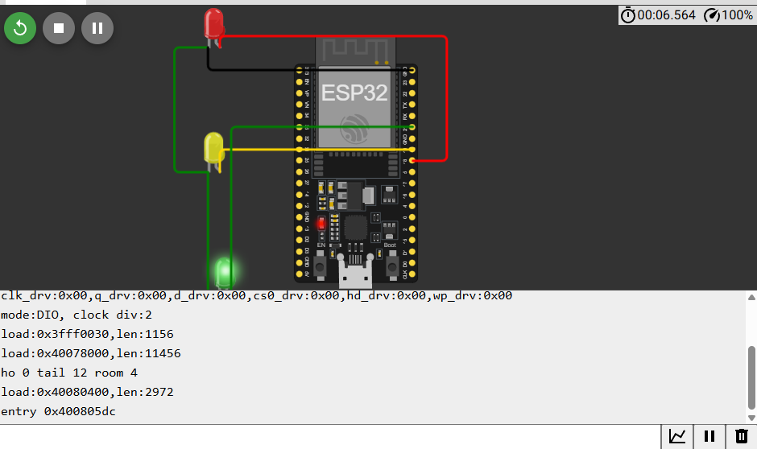

# Arduino Line Following Robot (Wokwi Simulation)

## 📸 Project Image


This project is a **Line Following Robot** built with Arduino and simulated using [Wokwi](https://wokwi.com/).  
It uses IR sensors to detect the line and control the robot’s movement accordingly.

---

## 🚀 Features
- Arduino Uno based
- IR sensors for line detection
- Motor driver for controlling wheels
- Circuit schematic included (`diagram.json`)
- Ready to run in **Wokwi Simulator**

---

## 🛠️ Getting Started

### Prerequisites
- [Arduino IDE](https://www.arduino.cc/en/software) or Wokwi account
- Basic knowledge of C++/Arduino programming
- Git for version control

### Running on Wokwi
1. Upload the project files (`sketch.ino`, `diagram.json`, `wokwi-project.txt`) to Wokwi.
2. Open the `sketch.ino` file.
3. Click **Run** ▶ to start the simulation.

### Running on Arduino Hardware
1. Upload `sketch.ino` to an **Arduino Uno** board.
2. Connect IR sensors and motor driver as shown in `diagram.json`.
3. Power up and place the robot on a track.

---

## 📜 License

This project is licensed under the MIT License
```
MIT License

Copyright (c) 2025 Nomanguni Khumalo

Permission is hereby granted, free of charge, to any person obtaining a copy
of this software and associated documentation files (the "Software"), to deal
in the Software without restriction, including without limitation the rights
to use, copy, modify, merge, publish, distribute, sublicense, and/or sell
copies of the Software, and to permit persons to whom the Software is
furnished to do so, subject to the following conditions:

[... full MIT license text ...]
```
## 👤 Author
Nomanguni Khumalo — AI & Robotics Enthusiast from Johannesburg
🔗 GitHub: @Nomanguni
📫 Email: nomangunik25@gmail.com
